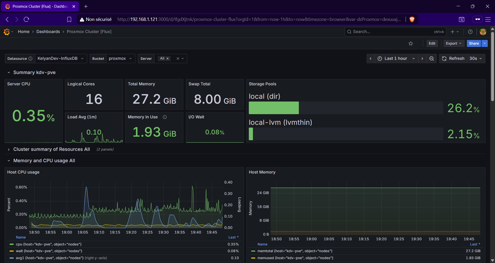
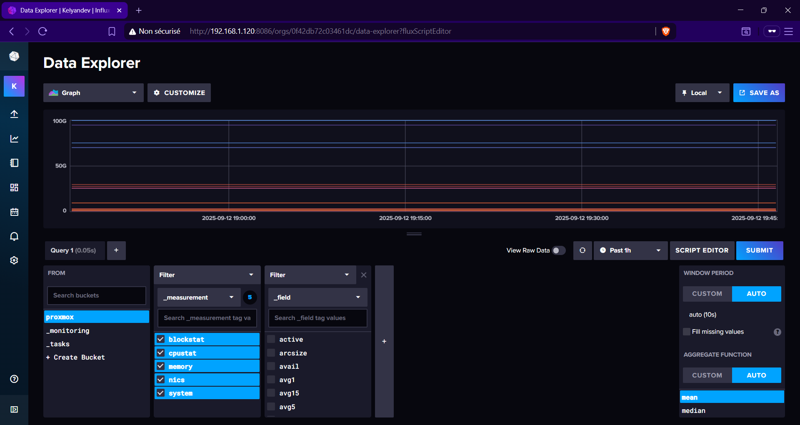

# Services

In this page, you'll find every general informations regarding all of the different services that I'm currently running on my Homelab. These services can go from the most basic Windows server to more specific ones such as my data and metrics monitoring services. Each service will (probably) have its own set of scripts and general informations on how to run them, even if I'm still not sure how I'll globally organize the repository

> **NAVIGATION**
> * [General](https://github.com/KelyanDev/Homelab) - All the general informations regarding my Homelab
> * [Apps](https://github.com/KelyanDev/Homelab/blob/main/apps/README.md) - List of all the current services I'm running

## Metrics & Monitoring

### Grafana

Grafana is a stunning dashboard tool that can translate various databases and showcase it into beautiful graphs, charts, or even presentations. There is a ton of custom dashboard created by the community for different use cases, and it can integrates with a lot of tech stacks. You can easily add a connection and import a dashboard to display the data.

   
  
   

#### Configuration & Installation
The best way I found to install Grafana is by running it inside Docker. At first, I tried using it inside a basic LXC container on my proxmox, but the service wasn't able to start because the container's root user isn't enough for systemd "sandboxing". I didn't want to run a privileged container for Grafana, so I chose the Docker option instead.

You can find various documentations / youtube videos to help you install Docker and Grafana on Linux. I personally chose Debian, but you can chose whatever Linux distribution you want that can run Docker & Grafana

### InfluxDB2

InfluxDB is an open-source time series database designed for high-speed ingestion and efficient querying of time-stamped data. This database tool is also capable of displaying the data into charts and graphs, but I'm mainly using it to gather metrics from my Proxmox server, before pulling it to Grafana dashboards

   
  
   

#### Configuration & Installation

