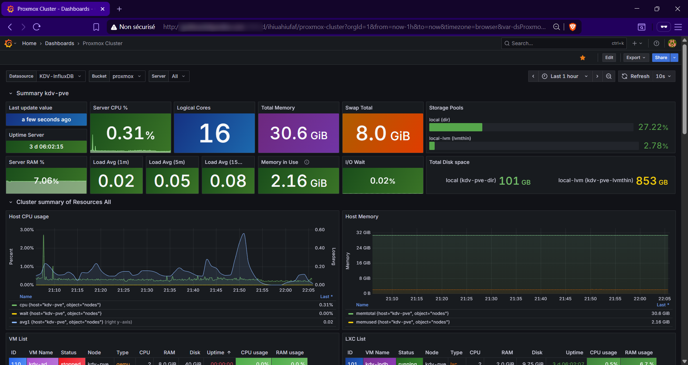

<h3 align="center">Services</h3>

  

    In this page, you'll find avery general informations regarding all of the different services that I'm currently running on my Homelab. Each service will (probably) have its own set of scripts and general informations on how to run them, even if I'm not sure how to organize it yet
     
    <a href="https://github.com/KelyanDev/Homelab"><strong>Explore the docs »</strong></a>
     
     
    Navigation  
    <a href="https://github.com/KelyanDev/Homelab">General</a>
    ·
    <a href="https://github.com/KelyanDev/Homelab/blob/main/apps/README.md"><strong>Apps</strong></a>
    ·
    <a href="https://github.com/KelyanDev/Homelab/blob/main/monitoring/README.md">Monitoring</a>
    ·
    <a href="https://github.com/KelyanDev/Homelab/blob/main/proxy/README.md">Proxy</a>
    ·
    <a href="https://github.com/KelyanDev/Homelab/blob/main/cloud/README.md">Cloud</a>
    ·
    <a href="">WIP</a>
  

## Files - Images

### Nextcloud

Nextcloud is an open-source, self-hosted file sync and share platform, acting as the best replacment for cloud services such as Google Drive, OneDrive and so on. The basic functionalities starts off as a great and solid base for a self-hosted cloud, and the addition of the multiple add-ons that can be easily added and configured really boost the potential of this on-premise cloud. From collaborative document editing to task management and video conferencing, this service really emphasizes data sovereignty and privacy.

   
  
   

  <a href="https://github.com/KelyanDev/Homelab/blob/main/cloud/README.md">Configuration</a>
  ·
  <a href="https://github.com/nextcloud">GitHub</a>

 

## DNS - Reverse Proxy

### Pi-Hole

Probably the most known DNS sinkhole (or network-wide ad-blocker), designed to protect devices on a private network from unwanted content by blocking certain DNS inquiries, using blacklists full of domains. Pi-Hole also has other multiple use cases, as I have personally configured mine as a classic DNS server. I haven't checked all of its functionalities yet, but it is surely a wonderful service to run and play with.

   
  
   

  <a href="https://github.com/KelyanDev/Homelab/blob/main/apps/pi-hole/README.md">Configuration</a>
  ·
  <a href="https://github.com/pi-hole/pi-hole">GitHub</a>

 

### Nginx Proxy Manager

NGINX Proxy Manager is an open-source web interface that simplifies the management of SSL certificates and the ability to expose secured web services on the Internet. This service is particularly useful to expose and secure trafic of the services I own on the public internet.

   
  
   

  <a href="https://github.com/KelyanDev/Homelab/blob/main/proxy/README.md">Configuration</a>
  ·
  <a href="https://github.com/NginxProxyManager/nginx-proxy-manager">GitHub</a>

 

## Metrics & Monitoring

### Grafana

Grafana is a stunning dashboard tool that can translate various databases and showcase it into beautiful graphs, charts, or even presentations. There is a ton of custom dashboard created by the community for different use cases, and it can integrates with a lot of tech stacks. You can easily add a connection and import a dashboard to display the data.

   
  
   

  <a href="https://github.com/KelyanDev/Homelab/blob/main/monitoring/README.md">Configuration</a>
  ·
  <a href="https://github.com/grafana/grafana">GitHub</a>

 

### InfluxDB2

InfluxDB is an open-source time series database designed for high-speed ingestion and efficient querying of time-stamped data. This database tool is also capable of displaying the data into charts and graphs, but I'm mainly using it to gather metrics from my Proxmox server, before pulling it to Grafana dashboards

   
  
   

  <a href="https://github.com/KelyanDev/Homelab/blob/main/monitoring/README.md">Configuration</a>
  ·
  <a href="https://github.com/influxdata/influxdb">GitHub</a>

