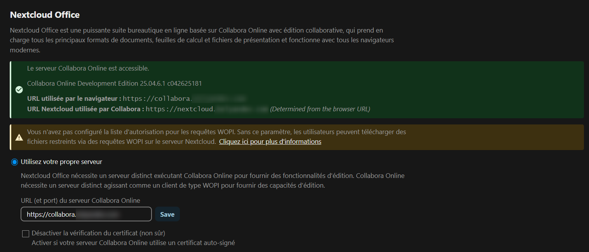

<h3 align="center">Cloud</h3>

  <p align="center">
    Regarding my cloud stack, I'm running Nextcloud in an LXC Docker compose container. This repository is my own <strong>WIP</strong> installation guide.
    <br />
    <a href="https://github.com/KelyanDev/Homelab"><strong>Explore the docs »</strong></a>
    <br />
    <br />
    Navigation <br />
    <a href="https://github.com/KelyanDev/Homelab">General</a>
    ·
    <a href="https://github.com/KelyanDev/Homelab/blob/main/apps/README.md">Apps</a>
    ·
    <a href="https://github.com/KelyanDev/Homelab/blob/main/monitoring/README.md">Monitoring</a>
    ·
    <a href="https://github.com/KelyanDev/Homelab/blob/main/proxy/README.md">Network</a>
    ·
    <a href="https://github.com/KelyanDev/Homelab/blob/main/cloud/README.md"><strong>Cloud</strong></a>
    <br />
    <a href="https://github.com/KelyanDev/Homelab/blob/main/media/README.md">Media</a>
    ·
    <a href="https://github.com/KelyanDev/Homelab/blob/main/storage/README.md">Storage</a>
    ·
    <a href="https://github.com/KelyanDev/Homelab/blob/main/game/README.md">Game</a>
    ·
    <a href="">WIP</a>
  </p>
</div>

## Installation

These steps assume that you have already configured the debian LXC container, and that you are connected as the root user in them.

The original documentations might as well be a better source of information, depending on your tech stack.


### NextCloud

> **Specs**
> - 2 vCpu
> - 4 GiB memory
> - 40 GiB storage

These are the initial steps regarding the installation of Nextcloud. 
The installation is done by using the [Docker compose file](https://github.com/KelyanDev/Homelab/blob/main/cloud/nextcloud/docker-compose.yml) of this repository
```
# Update packages:
apt update && apt upgrade -y

# Install the dependencies
apt install ca-certificates curl gnupg lsb-release apt-transport-https -y

# Add the Docker key to verify downloads and add the repository:
curl -fsSL https://download.docker.com/linux/debian/gpg | gpg --dearmor -o /etc/apt/keyrings/docker.gpg
echo \
  "deb [arch=$(dpkg --print-architecture) signed-by=/etc/apt/keyrings/docker.gpg] \
  https://download.docker.com/linux/debian $(lsb_release -cs) stable" | tee /etc/apt/sources.list.d/docker.list > /dev/null

# Finally, update your packages and install Docker & Docker compose
apt update && apt install docker-ce docker-ce-cli containerd.io docker-buildx-plugin docker-compose-plugin -y
```

Once all these steps are done and the installation proceeded, we'll finally be able to start configure Nextcloud   

First, we'll have to prepare the folder in which we'll put the docker-compose.yml file.  
```
# Create the directory
mkdir -p /opt/nextcloud
cd /opt/nextcloud

# Create the docker-compose.yml file - my config file can be found at the beginning
nano docker-compose.yml

# Create and start the Nextcloud stack
docker compose up -d
```
Then, you can start to configure and play with your Nextcloud. The initial steps needs you to configure the Admin user and the database user.

#### Collabora
Making Collabora works can be a mess the first time, so here's my installation and configuration "procedure"

> [!WARNING]
> This procedure is made to configure Collabora and Nextcloud Office using a **Reverse proxy** !!     
> I personally used Nginx Proxy manager, but you can use whatever you prefer as long as it can get the job done
> 
> Also, this procedure is made for configuring a **dedicated** Collabora server - not the builtin version proposed in the Nextcloud appstore

<br />

**First step: Configuring the DNS**        
Nextcloud and Collabora must be resolved to a domain (for example, nextcloud.example.com and collabora.example.com) - This way, you'll have no trouble configuring the Nextcloud office instance (which is probably the most ennoying part, cause it won't work and you won't know why)        
For this step, you can use a domain provider and buy your own custom domain, or configure your own internal domain.        

I personally used both options, as I have Pi-Hole as my main DNS server in my homelab, while my domain provider allows me to connect from Internet

<br />

**Second step: Configuring your reverse proxy**         
You'll need to activate SSL for this setup to work fine without losing all your hair in the process, so you'll need to configure certificates for Collabora and Nextcloud either using Let's encrypt or your own generated one       
Then, in your reverse config proxy, make sure that HSTS is enabled, to always redirect HTTP connexions to HTTPS. You can do it manually by adding this:      

```
proxy_set_header Upgrade $http_upgrade;
proxy_set_header Connection "upgrade";

# You can also add this in case it doesn't work initially
X-Forwarded-Proto: https
```

<br />

**Third step: Configuring the Collabora container**        
This step consists of creating a new collabora container inside our previous Docker-compose.yml:

```
collabora:
    image: collabora/code:latest
    container_name: collabora
    restart: unless-stopped
    environment:
      - domain=nextcloud\\.example\\.com # I put the previous example here, but you need to put you nextcloud domain name, to allow it to connect to your Collabora server
      - username=admin
      - password=password
      - extra_params=--o:ssl.enable=false --o:ssl.termination=true # These settings will tell your Collabora that 1. It doesn't use SSL and 2. A reverse proxy handles the SSL part
    ports:
      - 9980:9980
```

<br />

**Fourth step: Configuring Nextcloud**        
This step consists of modifying the config.php file of the Nextcloud server, to trust our proxy and automatically change the protocol.     
In your config/config.php file on your nextcloud instance:

```
'trusted_domains' => [
  'nextcloud.example.com',  # Change this to your own Nextcloud domain - this line tells your Nextcloud to allow connexions using this domain in your browser
],
'trusted_proxies' => [
  '{ReverseProxyIp}',     # Change this part with your reverse proxy IP address
],
'overwrite.cli.url' => 'https://nextcloud.example.com',  # Once again, change this line with your own Nextcloud domain - this line tells your Nextcloud to automatically overwrite the URL
'overwriteprotocol' => 'https',
```

<br />

**Fifth step: Nextcloud Office configuration**       
In this step, we'll configure Nextcloud to allow it to talk and connect with our Collabora instance.    

For this, we'll need to connect to our Nextcloud on its domain name in our web browser, using the Admin user. Once connected, we'll go to **Administration parameters** > **Nextcloud Office**     
You'll need to check the "Use your own server" option, and put in the Collabora's domain name as the URL    

<div align="center">
  <br />
  
  <br />
</div>

If your configuration is alright, the green section that you can see above should show and **STAY** (if it doesn't stay and turns to red after some times, it means that your Nextcloud and Collabora are working fine, but your web browser is unable to access the Collabora server using the URL you provided)

<hr/>

### Immich

> **Specs**
> - 4 vCpu
> - 6 GiB memory
> - 80 GiB storage

These steps follow the official installation guide for Immich, which you can find [here](https://docs.immich.app/overview/quick-start/)

```
# Update packages:
apt update && apt upgrade -y

# Install the dependencies
apt install ca-certificates curl gnupg lsb-release apt-transport-https -y

# Add the Docker key to verify downloads and add the repository:
curl -fsSL https://download.docker.com/linux/debian/gpg | gpg --dearmor -o /etc/apt/keyrings/docker.gpg
echo \
  "deb [arch=$(dpkg --print-architecture) signed-by=/etc/apt/keyrings/docker.gpg] \
  https://download.docker.com/linux/debian $(lsb_release -cs) stable" | tee /etc/apt/sources.list.d/docker.list > /dev/null

# Finally, update your packages and install Docker & Docker compose
apt update && apt install docker-ce docker-ce-cli containerd.io docker-buildx-plugin docker-compose-plugin -y
```

Once all these steps are done and the installation proceeded, we'll finally be able to install Immich

```
# Create a repository for your immich instance
mkdir /tmp/immich-instance && cd /tmp/immich-instance

# Get the official docker-compose file
wget -O docker-compose.yml https://github.com/immich-app/immich/releases/latest/download/docker-compose.yml

# Get the official .env file, in which you'll need to change the config
wget -O .env https://github.com/immich-app/immich/releases/latest/download/example.env
```

Once all the files are downloaded, you'll be able to change directories for your instance by changing the parameters in the .env file.      
You can, of course, live it like it is, but I wouldn't recommend it.     

Then, you can simply start your containers, and your immich instance should be up and running.    
You can access it with the network port 2283.

